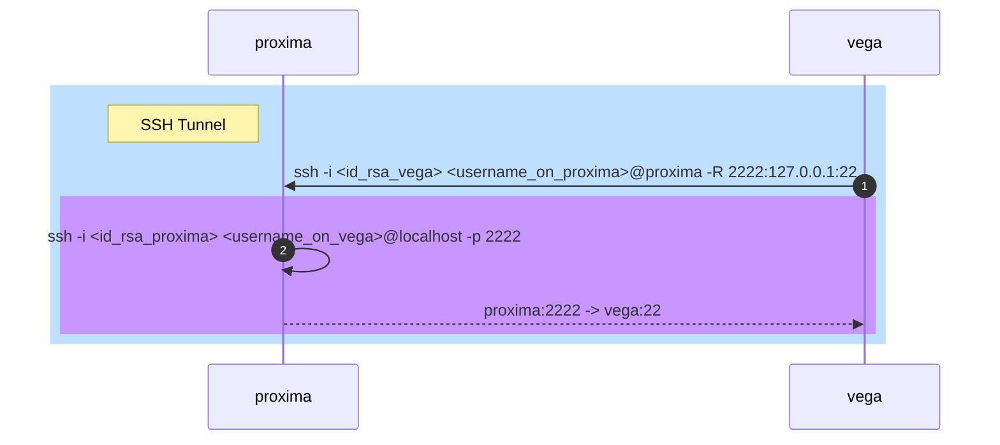

# [Cloudflare Tunnel client](https://developers.cloudflare.com/cloudflare-one/connections/connect-apps/use_cases/)
## HTTP Tunnel
```sh
./cloudflared tunnel --url http://localhost:8000
```

## HTTPS Tunnel
```sh
./cloudflared tunnel --no-tls-verify --url https://<url>/
```

## RDP tunnel
```sh
# jump server
./cloudflared tunnel --no-tls-verify --url rdp://<target_rdp_server>:3389
# client
./cloudflared access rdp --hostname <url_from_the_previous_command> --url rdp://localhost:13389
# connect to localhost:13389 in an rdp client
```

## SMB tunnel
```sh
# jump server
cloudflared.exe tunnel --url smb://<sever_with_smb_share>:445
# client
cloudflared.exe access tcp --hostname rainbow-alignment-risk-harold.trycloudflare.com --url localhost:8445
# connect to smb://localhost:8445 in an smb client
```

# SSH
## SSH over an SSH tunnel


  0. Add a public key to authorized keys:
```sh
echo "<public_key>" >> ~/.ssh/authorized_keys
chmod 600 ~/.ssh/authorized_keys
```
  1. Connect **vega** to **proxima**
```sh
ssh -i <id_rsa_vega> <username_on_proxima>@proxima -R 2222:127.0.0.1:22 # Listen on port TCP 2222 on proxima/localhost
```
  2. Connect to the target host
```sh
ssh -i <id_rsa_proxima> <username_on_vega>@localhost -p 2222
```
