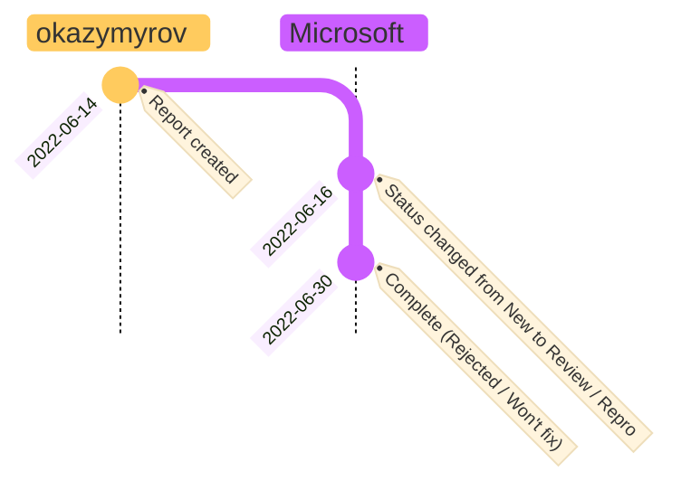

# OneDrive for Business: Bypass "Anyone with the link" restriction

## Answer from Microsoft (VULN-069036 / MSRC Case 72610 CRM:0022004898):
> We determined that a specific fix will not be released for the reported behavior.
> However, we do have an option you can opt-into, which:
> - Reduces download URL to 15 minutes when there is an IP change 
> - Download URL is instantly blocked if SPO IP policy is set, and request comes from outside of IP range
 
## Timeline

<!--

```mermaid
 info
```

Tested on v10.6.1



-->

| Date | Status|
| --- | --- |
| 2022-06-14| Report created |
| 2022-06-16| Status changed from **New** to **Review / Repro** |
| 2022-06-30| Complete (**Rejected / Won't fix**) |

## Steps to reproduce:
1.	Go to https://developer.microsoft.com/en-us/graph/graph-explorer
2.	Run query https://graph.microsoft.com/v1.0/me/drive/root/children
3.	Find the first file (i.e., "All Japan Revenues By City.xlsx") and copy "@microsoft.graph.downloadUrl"
4.	Open "@microsoft.graph.downloadUrl" in a browser on another device with another IP
5.	Observe that the file is downloaded without any security verification, which bypasses disabled "Anyone with the link".

# OneDrive for Business: Bypass "Anyone with the link" restriction using user interface

## Answer from Microsoft (VULN-094764 / MSRC Case 77791 CRM:0022019452):
> ... <br>
> Thank you again for your report and your patience! <br>
> ...

## Timeline
| Date | Status|
| --- | --- |
| 2023-02-21| Report created |
| 2023-02-22| Status changed from **New** to **Review / Repro** |
| 2023-03-02| Status changed from **Review / Repro** to **Develop** |
| 2023-11-03| Status changed from **Develop** to **Pre-Release** |
| 2024-01-19| Status changed from **Pre-Release** to **Complete - Duplicate** |

## Summary
Bypass "Anyone with the link" can be done using user interface (without access to Graph API).

## Steps to Reproduce

* It is assumes that OneDrive is installed on a PC and OneDrive is configured to disable "external sharing with Anyone"
1. Create test.txt on OneDrive with content "Version 1" and save it
2. Change content of test.txt to "Version 2" and save it
3. In Explorer right click test.txt and choose "Version history"
4. Choose any priveous version from "More options" (three dots) and click Download
5. Open downloads page in the default browser and "Copy download link"
6. Send the link to the another device (with another IP) and download the file without any authentication

## Supporting materials/references:
* To download the latest file one can replace with the same file to increase the version
* JWT is valid for 1 day.
