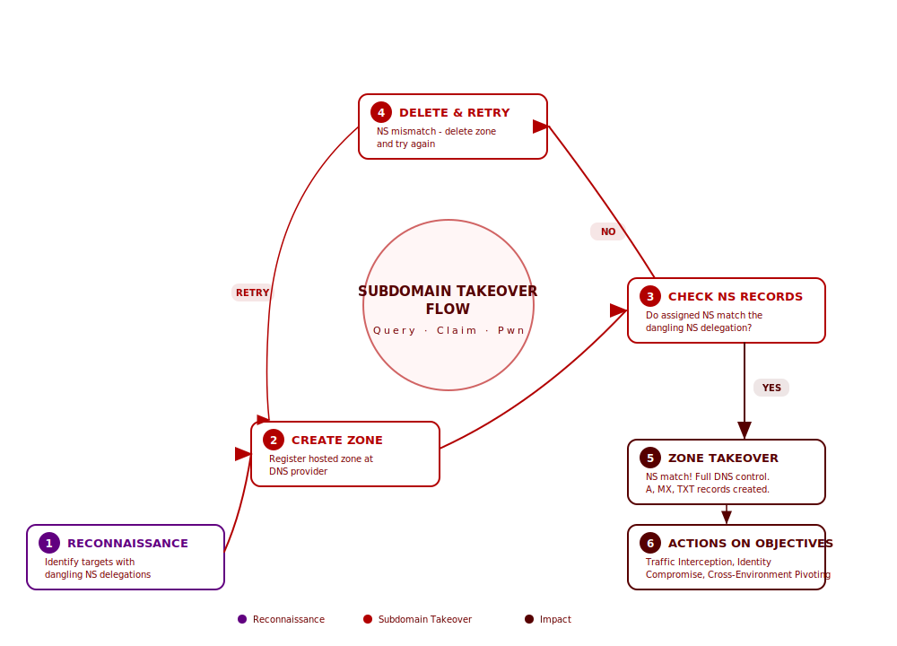
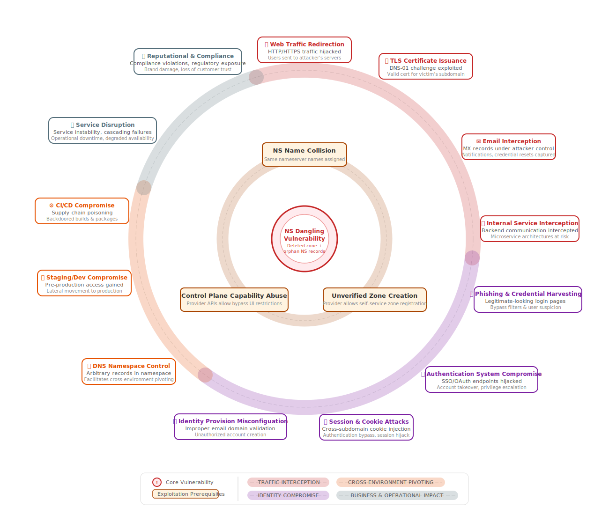
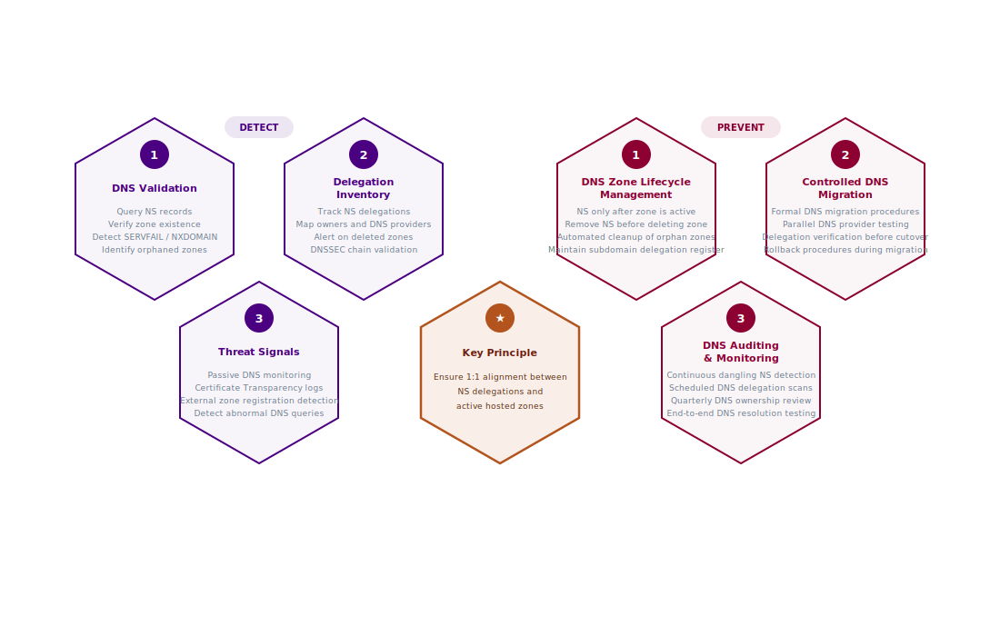

# Subdomain Takeover via Dangling NS Records

## Provider Evaluation Summary

The table below summarizes the DNS providers that were tested for **Proof of Vulnerability (PoV)** involving delegated subdomains with dangling NS records referencing public DNS providers. The tests assessed whether an attacker could register the corresponding DNS zone with the provider and gain control over the delegated subdomain.

| DNS Provider | PoV (December 2025) | PoV (February 2026) |
|--------------|---------------------|---------------------|
| [Cloudflare (Free)](Cloudflare.md) | ❌ | - |
| [Amazon Route 53*](AWS.md) | ❌ | ✅ |
| [Microsoft (Azure DNS)](Microsoft.md) | ✅ | ✅ |
| [Google Cloud DNS](Google.md) | ✅ | ❌ |
| [DNSimple](DNSimple.md) | ✅ | ❌ |
| Imperva | ❌ | - |

**Notes**
- **Amazon Route  53\***: In December, Amazon Route 53 testing was limited to a PoV using **controlled domains**. It was later discovered that delegation sets could be leveraged to scale the attack efficiently, allowing us to demonstrate a PoV on real-world domains.
- **Enterprise DNS providers:** CSCDBS, MarkMonitor, Cloudflare Business/Enterprise, and similar enterprise-focused providers were excluded due to access limitations
- '\-' subsequntly not tested

## Understanding Dangling NS Records at the Subdomain Level

**NS dangling** at the subdomain level occurs when a subdomain (e.g., `api.example.com` or `staging.example.com`) has NS records delegating DNS resolution to name servers that are no longer operational or authoritative for that subdomain. The delegation remains in the parent zone, but the corresponding zone at the DNS provider has been deleted or is no longer under the organization's control.

### Key Difference from CNAME Takeover

Unlike CNAME-based subdomain takeovers which affect individual hostnames, **NS dangling at the subdomain level compromises an entire delegated namespace**, granting attackers the ability to create arbitrary DNS records for any name within the delegated subdomain and its children.

### How Subdomain NS Dangling Occurs

This vulnerability typically arises during:

- **DNS provider migration errors** - Subdomains delegated via NS records are not updated or removed when the organization migrates to a new DNS provider
- **Infrastructure decommissioning** - Authoritative name servers are shut down or removed while parent domains still contain active NS delegations
- **Expired or deleted DNS hosting accounts** - DNS zones are removed when accounts expire or are deleted, leaving the delegated subdomain unclaimed
- **Third-party service termination** - External vendors or SaaS providers that hosted delegated DNS zones are offboarded without removing the NS delegation
- **Abandoned projects or environments** - Temporary environments (e.g., staging, testing, campaign subdomains) are retired but their NS delegations remain in the parent zone

### Generalized Subdomain Delegation Takeover Model

When a subdomain's dangling NS records reference name servers belonging to a public DNS provider, an attacker can:

1. Register a hosted zone for the same subdomain at the referenced DNS provider.
2. If the provider assigns name servers matching the existing dangling NS delegation, the attacker obtains authoritative control over the subdomain.
3. This enables full control over DNS resolution and the creation of DNS records within the delegated subdomain namespace.

## Security Impact

Because NS records defined at the subdomain level delegate authority for an entire DNS namespace, a dangling NS record can result in a high-impact compromise affecting all services within that subdomain. The severity of this issue comes from the fact that an attacker can obtain full DNS control over the delegated subdomain, rather than only taking over a single hostname.

<h3 style="display:inline">Scenarios</h3>

#### Traffic Interception

##### 1. Web Traffic Redirection
An adversary registers the dangling zone and creates A/AAAA records pointing `app.mon.example.com` to their own server. Users and automated clients that rely on this subdomain are silently redirected to adversary-controlled infrastructure, enabling session token theft and malware delivery.

##### 2. TLS Certificate Issuance
With DNS control of the delegated subdomain, the adversary completes a DNS-01 ACME challenge and obtains a valid TLS certificate for `*.api.example.com`. HTTPS connections to any name under the subdomain now appear fully trusted in browsers and API clients.

##### 3. Email Interception
The adversary publishes MX records for `mon.example.com` pointing to their mail server. Password-reset emails, notification messages, and internal communications addressed to `*@mon.example.com` are silently captured, enabling account takeover and data exfiltration.

##### 4. Internal Service Interception
A microservice discovers backends via DNS at `svc.api.example.com`. The adversary responds with their own endpoint, intercepting API calls, harvesting credentials, and injecting tampered responses into the service mesh without triggering certificate warnings.

#### Identity Compromise

##### 5. Phishing & Credential Harvesting
The adversary hosts a pixel-perfect login page at `portal.mon.example.com` with a valid TLS certificate. Because the URL sits under the organization's real domain, email filters pass the link and users enter credentials without suspicion.

##### 6. Authentication System Compromise
An SSO endpoint delegated at `sso.example.com` is taken over. The adversary intercepts OAuth authorization codes and SAML assertions, gaining authenticated sessions to downstream applications without needing user passwords.

##### 7. Session & Cookie Attacks
The adversary creates `portal.mon.example.com` and sets a cookie scoped to `.example.com`. When a user next visits the legitimate application, the injected cookie fixates or hijacks the session, bypassing authentication controls.

##### 8. Identity Provisioning Misconfiguration

The adversary configures MX records and creates email addresses such as `first.last@mon.example.com`. If an identity provider or SaaS platform trusts any address under `*.example.com` for account verification or automatic provisioning, the adversary can register accounts using this email domain. In environments where access policies or dynamic groups rely on email domain matching (e.g, `domain contains .example.com AND user startsWith 'admin-cloud-'`), this may allow the adversary to obtain internal user accounts or elevated access within organizational systems.

#### Cross-Environment Pivoting

##### 9. DNS Namespace Control
After claiming the zone, the adversary publishes wildcard records (`*.api.example.com`) and arbitrary record types (A, MX, TXT, SRV, etc.). Every name under the delegated subdomain now resolves to adversary-chosen values, enabling any of the scenarios simultaneously.

##### 10. Staging/Dev Compromise

The zone for `staging.example.com` was removed during a DNS provider migration, but the NS delegation in the parent zone remained. This allows interception of traffic to pre-production services, potentially exposing reused database credentials, API keys, or other secrets used in development and CI/CD pipelines.

##### 11. CI/CD Compromise
Build webhooks at `ci.example.com` point to the dangling delegation. The adversary receives push events, triggers malicious builds, and publishes backdoored artifacts to the organization's container registry, poisoning the software supply chain.

#### Business & Operational Impact

##### 12. Service Disruption
Dependent services querying `api.example.com` receive SERVFAIL or adversary-controlled responses, causing cascading timeouts and degraded availability across production systems - even if the adversary takes no further action.

##### 13. Reputational & Compliance Impact

An adversary identifies a large number of dangling NS delegations and claims control over the corresponding DNS zones and infrastructure. The issue becomes publicly disclosed, leading to regulatory scrutiny under NIS2/GDPR. As a result, customer trust is impacted, and the finding is flagged as a critical issue during the organization's next external security audit.

## Detection & Prevention

