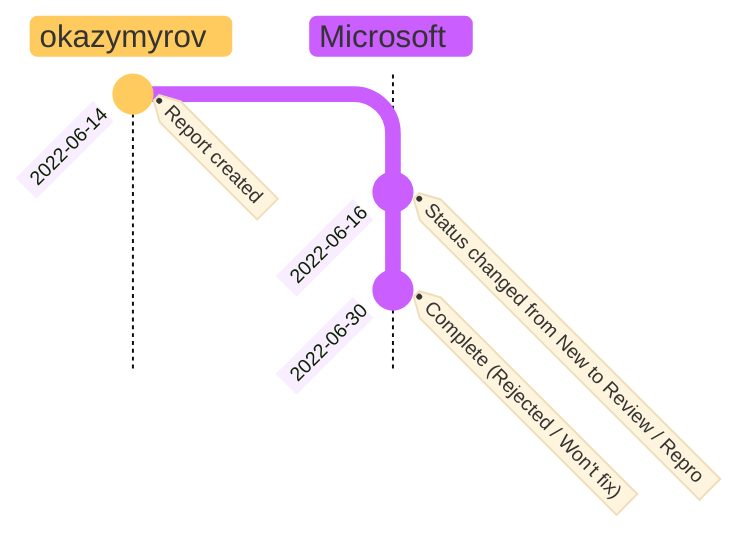
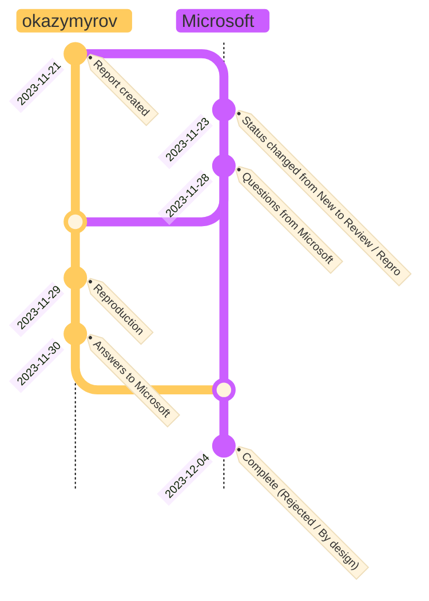

# OneDrive for Business: Bypass "Anyone with the link" restriction

## Answer from Microsoft (VULN-069036 / MSRC Case 72610 CRM:0022004898):
> We determined that a specific fix will not be released for the reported behavior.
> However, we do have an option you can opt-into, which:
> - Reduces download URL to 15 minutes when there is an IP change 
> - Download URL is instantly blocked if SPO IP policy is set, and request comes from outside of IP range
 
## Timeline

<!--

```mermaid
 info
```

Tested on v10.6.1



-->

| Date | Status|
| --- | --- |
| 2022-06-14| Report created |
| 2022-06-16| Status changed from **New** to **Review / Repro** |
| 2022-06-30| Complete (**Rejected / Won't fix**) |

## Steps to reproduce:
1.	Go to https://developer.microsoft.com/en-us/graph/graph-explorer
2.	Run query https://graph.microsoft.com/v1.0/me/drive/root/children
3.	Find the first file (i.e., "All Japan Revenues By City.xlsx") and copy "@microsoft.graph.downloadUrl"
4.	Open "@microsoft.graph.downloadUrl" in a browser on another device with another IP
5.	Observe that the file is downloaded without any security verification, which bypasses disabled "Anyone with the link".

# OneDrive for Business: Bypass "Anyone with the link" restriction using user interface

## Answer from Microsoft (VULN-094764 / MSRC Case 77791 CRM:0022019452):
> ... <br>
> Thank you again for your report and your patience! <br>
> ...

## Timeline
| Date | Status|
| --- | --- |
| 2023-02-21| Report created |
| 2023-02-22| Status changed from **New** to **Review / Repro** |
| 2023-03-02| Status changed from **Review / Repro** to **Develop** |
| 2023-11-03| Status changed from **Develop** to **Pre-Release** |
| 2024-01-19| Status changed from **Pre-Release** to **Complete - Duplicate** |

## Summary
Bypass "Anyone with the link" can be done using user interface (without access to Graph API).

## Steps to Reproduce

* It is assumes that OneDrive is installed on a PC and OneDrive is configured to disable "external sharing with Anyone"
1. Create test.txt on OneDrive with content "Version 1" and save it
2. Change content of test.txt to "Version 2" and save it
3. In Explorer right click test.txt and choose "Version history"
4. Choose any priveous version from "More options" (three dots) and click Download
5. Open downloads page in the default browser and "Copy download link"
6. Send the link to the another device (with another IP) and download the file without any authentication

## Supporting materials/references:
* To download the latest file one can replace with the same file to increase the version
* JWT is valid for 1 day.

# Bypass MFA authorization in multi-session AVD

## Answer from Microsoft (VULN-113950 / MSRC Case 83840 CRM:0022036283):
> Thank you again for submitting this issue to Microsoft. We determined that this behavior is considered to be by design because SSO is not enabled on the server and one has to enable AAD SSO https://learn.microsoft.com/en-us/azure/virtual-desktop/configure-single-sign-on if they want to get MFA to work.

## Timeline

<!--

```mermaid
 info
```

Tested on v10.6.1



-->

| Date | Status|
| --- | --- |
| 2023-11-21| Report created |
| 2023-11-23| Status changed from **New** to **Review / Repro** |
| 2023-11-29| Questions from Microsoft |
| 2023-11-28| Reproduction in the test environment |
| 2023-11-30| Answers to Microsoft |
| 2023-12-04| Complete (**Rejected / By design**) |

## Summary
When using Microsoft Remote Desktop in the browser, the multi-factor authentication (MFA) is only applied to the web app (the client), not to the remote desktop session. This means that an attacker who accesses a shared Azure Virtual Desktop (AVD) with multiple sessions can switch to other users in the browser without MFA verification.

## Description
On occasions, applications are open to guest users requiring connection to an internal system via a multi-session, commonly referred to as a shared, Azure Virtual Desktop (AVD). This introduces a security concern, as an unauthorized individual gaining entry to the tenant through a user with shared AVD privileges can impersonate other users in the browser without undergoing multi-factor authentication (MFA).

## Steps to Reproduce
### Prerequisites
* The adversary can log on as User 1 (including MFA)
* Multi-session AVD is enabled for User 1, User 2 and User 3 in the same tenant
* The adversary knows passwords for User 2 and User 3 (not MFA)

### Steps
1. Log on AVD as User 1
2. Open an app in AVD
3. On the logon page, use credentials from User 2
4. Observe that MFA is not required for User 2

### Supporting materials/references:
#### Possible Consequences
* Take over active sessions (including desktop applications and active sessions in browsers) for User 2
* Create an MFA backdoor for users satisfying MFA in the token
* Connect to other accounts on the same server using RDP. For example, by using the application escape technique shadow the remote desktop session of User 3 from User 2.

#### A kill chain from a real engagement:
* Compromize an account from 3rd party vendor (i.e., User 1) having access to the Contoso tenant.
* Collect a list of valid passwords for users in Contoso (i.e., for User 2 and User 3).
* Obtain a valid session for User 1 with MFA satisfied ([reproducible step 1](https://github.com/okazymyrov/piki/blob/master/Vulnerabilities/Vulnerabilities.md#steps)).
* Open Edge ([reproducible step 2](https://github.com/okazymyrov/piki/blob/master/Vulnerabilities/Vulnerabilities.md#steps)).
* When prompted for credentials, use User 2 login and password (no MFA required) ([reproducible step 3](https://github.com/okazymyrov/piki/blob/master/Vulnerabilities/Vulnerabilities.md#steps)).
* Open the task manager (i.e., using the application escape technique) to monitor users logged into the shared AVD.
* During lunch (higher chance of having browsers open and a valid token with MFA satisfied), login as a different user via RDP shadowing using User 3's credentials (alternatively right click in the task manager on the user and then connect).
* If the user has recently authenticated to the Contoso tenant using MFA (i.e., the MFA requirement is contained in the token), update that user's security information to include an attacker-controlled security factor (such as TOTP).
